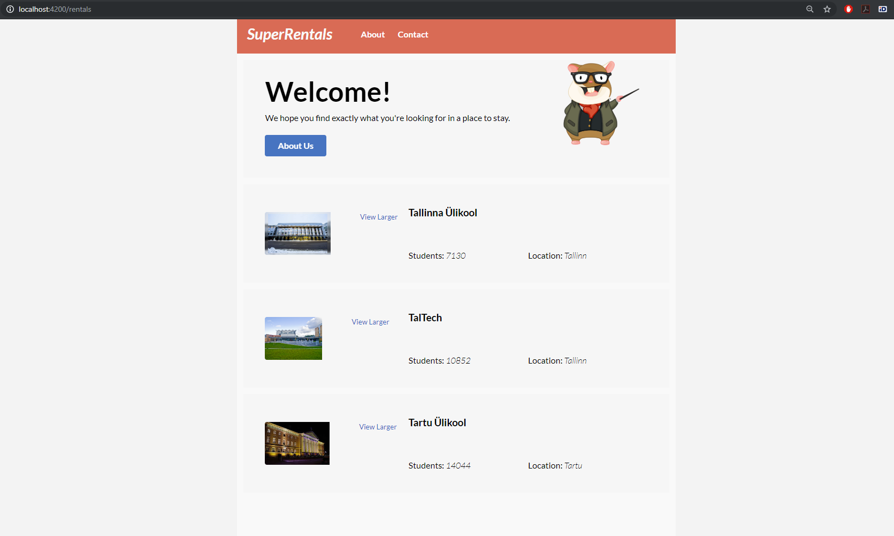

# Ember.js - Kert Tamm 2.tunnitöö

GITHUB demo link: https://github.com/rihon/ember

powershell lahti adminina

terminalis:
kontrolliks **npm**, kui näitab et olemas siis edasi

probleemide vältimiseks installida värskeim npm versioon

**npm install npm@latest -g**

**npm install -g ember-cli**

**ember new rentals**

edasi minna rentalite kausta
**cd .\rentals**

**ember serve**

siis edasi kui servitud on avada brauseris

**http://localhost:4200/**

testide jaoks:

**ember g acceptance-test rentals**

siis terminalis code või . code ja otsida üles projekti kaust ning avada VScode’s

siis muutsime **test/acceptance/rentals-test.js** faili ja kirjutasime uusi teste juurde

powershellis:
**ember test --server**

**ember generate route about**

siis peale seda avada **templates/about.hbs**

ja kirjutada sisse kood

**application.hbs** koodist peale outleti muu ära võtta

**ember generate route contact**

siis **contact.hbs** sisse kirjutada kood

**ember generate route rentals**

**ember generate route index**

**ember serve**

kui vaja siis **npm install**

kui puudu olev npm installitud siis saab panna **ember serve**

ja siis avada brauseris **http://localhost:4200/rentals**

edasine õpetus kui ise teha:

siis hakati tegema css installimist terminalis

**ember install ember-cli-tutorial-style**

**ember generate component rental-listing**
